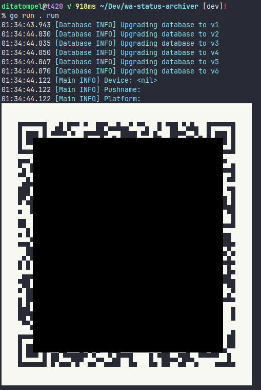
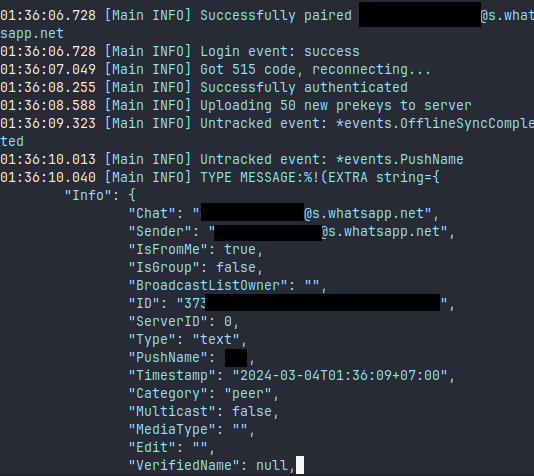
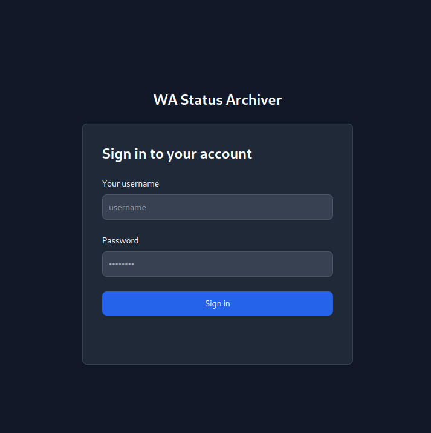
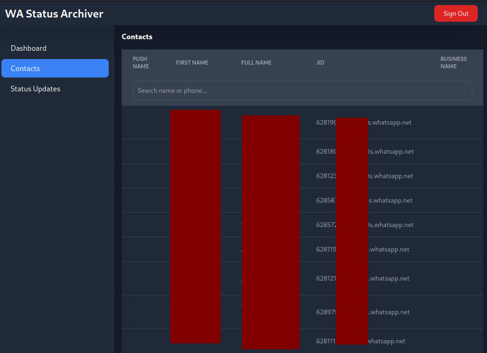
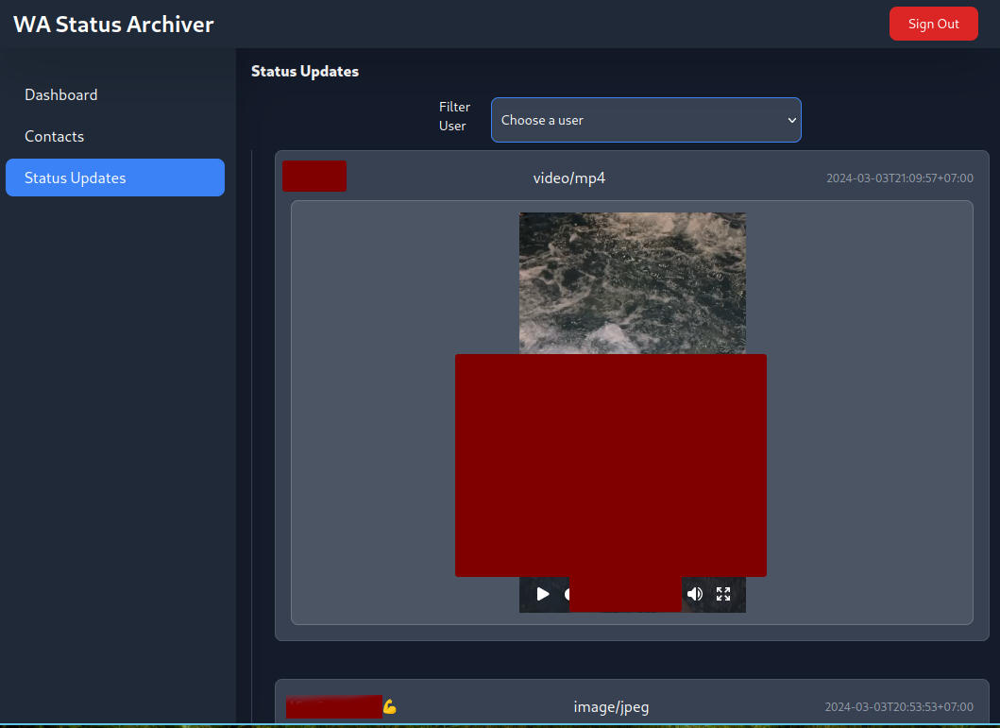

# WA Status Archiver

> This is **experimental**, use at your own risk. And **DO NOT** (I repeat, **DO NOT**) expose the WEB UI to the public!

This is a simple app that preserve your WA contact status updates (videos and images) to your local storage. Optionally, you can build a bot that respond to certain keywords on top of it.

A little background about this project: I want to learn and write my first **HTMX** app. Instead of usual _“To-Do's”_ app, I want to start with something different using `go.mau.fi/whatsmeow`.

## 1. Attribution

Attribution comes first, this project is build on top of these following awesome open source projects:

-   [go.mau.fi/whatsmeow](https://github.com/tulir/whatsmeow/)
-   [HTMX](https://htmx.org/)
-   [Tailwind CSS](https://tailwindcss.com/)
-   [gofiber/fiber](https://github.com/gofiber/fiber)
-   [mdp/qrterminal](https://github.com/mdp/qrterminal)
-   [spf13/cobra](https://github.com/spf13/cobra)
-   [joho/godotenv](https://github.com/joho/godotenv)
-   [alexedwards/argon2id](https://github.com/alexedwards/argon2id)
-   [golang.org/x/term](https://pkg.go.dev/golang.org/x/term)
-   [gosimple/slug](https://github.com/gosimple/slug)
-   [Flowbite](https://flowbite.com) (Tailwind design components)

And many indirect dependencies can be found in `go.mod`, `go.sum`, `package.json` and `package-lock.json`.

## 2. Trying this app

Screenshot: , , , , 

### 2.1 Requirements (tested on)

-   Node.js >=20.x
-   Go 1.22.x
-   PostgreSQL >=15.x

### 2.2 Prepare the assets

> Only run these steps once.

1. Clone this repository
2. Copy `.env.example` to `.env` and modify as needed (especially `SECRET_KEY` and **DB** config)
3. run `npm ci`
4. run `make static`

### 2.3 Running the “bot”

1. Run `go run . run`
2. On initial setup, it will display QR code. Scan it by linking device with your phone.

### 2.4 Running the web UI

To access Web UI, you need to create an admin account. This can be done by running `go run . admin create` and fill your username and password.

After that, you can run `go run . serve` and access the UI from the browser. (default: http://127.0.0.1:18088)

## 3. Build the binary file

```shell
make build
```

The binary file will be placed in the `bin` directory.

## 4. Development

If you want to develop or modify UI:

```shell
npm install
make static
npm run dev
go run . serve
```

Thanks to [cosmtrek/air](https://github.com/cosmtrek/air), you can run `air serve` to live reload the HTTP server (Do not use `air` when running `run` command).

## 5. To-Do's

-   Write the To-Do's (LMAO)

## 6. FAQ

### 6.1 Is this project stable?

Definitely **NO**.

### 6.2 What database is supported?

Although `whatsmeow` support **SQLite** and **PostgreSQL**, I only create this project on top of PostgreSQL. Feel free to adapt and implement the database driver to fit with your needs.

### 6.3 Is this project support for multiple WA account?

No, this project only support one account.
